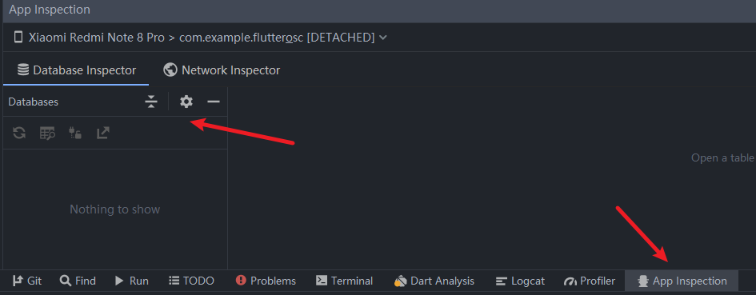

# 一些小技巧

## 改包名

在 Flutter 中，并没有统一地修改图标、应用名称和包名的地方，所以要在各自语言对应的地方进行修改:

### 包名

- Android 是在 `android` ▸ `app` ▸ `src` ▸ `main` ▸ `AndroidManifest.xml` 中修改`package="xxx.xxx.xxx"`;
  以及在 `android` ▸ `app` ▸ `src` ▸ `build.gradle`中修改`applicationId "xxx.xxx.xxx"`;
  并且需要修改`android` ▸ `app` ▸ `src` ▸ `main` ▸ `......` ▸ `MainActivity.java`对应的包路径
- iOS 在 `ios` ▸ `Runner` ▸ `Info.plist` 中修改`CFBundleIdentifier`对应的Value

写法与原生相同，并且可以不一致。

> PS:不推荐修改包名，包名最好在项目开始时定下...之后修改可能会出点什么小问题...

### 应用名称

- Android 是在 `android` ▸ `app` ▸ `src` ▸ `main` ▸ `AndroidManifest.xml` 中修改`android:label="XXX"`;
- iOS 在 `ios` ▸ `Runner` ▸ `Info.plist` 中修改`CFBundleName`对应的Value

### 图标

- Android 在`android` ▸ `app` ▸ `src` ▸ `res` ▸ `mipmap-...` 文件夹中替换相应图片
- iOS 在 `ios` ▸ `Runner` ▸ `Assets.xcassets` ▸ `AppIcon.appiconset`文件夹中替换相应尺寸的图片， 如果使用不同的文件名，那还必须更新同一目录中的`Contents.json`文件。

### 启动图片

- Android 在`android` ▸ `app` ▸ `src` ▸ `res` ▸ `drawable` ▸ `launch_background.xml` 通过自定义drawable来实现自定义启动界面。
- iOS 在 `ios` ▸ `Runner` ▸ `Assets.xcassets` ▸ `LaunchImage.imageset`文件夹中替换相应尺寸的图片， 如果使用不同的文件名，那还必须更新同一目录中的`Contents.json`文件。

### 其他方式

可以使用Xcode打开ios文件夹下的`Runner.xcworkspace`项目，像原生项目一样修改。

## 查看数据库和shared_references

> 查看数据库

点在android studio下面的`App Inspecttion`,找到连接的设备就可以看到sqlite数据库


点开android studio右侧的`Device File Explorer`,找到 `data => data => 包名`,下面有一个`shared_prefs`文件夹,就是shared_preference数据

## 响应式布局

### Flutter适配iPad和平板的原理

  其实吧，在Flutter中适配各种尺寸像iPad、平板甚至现在Flutter可以支持web、Desktop之后，有更多的屏幕适配。试着想一想我们在ios、Android原生中怎么做的适配？

  首先，我们的知道屏幕是什么尺寸的，然后给不同尺寸的屏幕定义一个范围，如：手机屏幕在一个范围内，pad在一个范围内。然后在获取当前的横竖屏状态，根据屏幕尺寸和横竖屏状态，给屏幕设置一个layout布局。

  其实，在Flutter中也一样。很多第三方库中设置了当屏幕最小边的范围小于600时就是手机屏幕。大于600就是pad...

```text
< 600: mobile
600 < ScreenSize < 950: tablet
大于950: desktop
```

定义好标准后，第三方库做的无非就是定义一些widget wrapper，(包装类)。一些定义设置值得方法。仅此而已。
